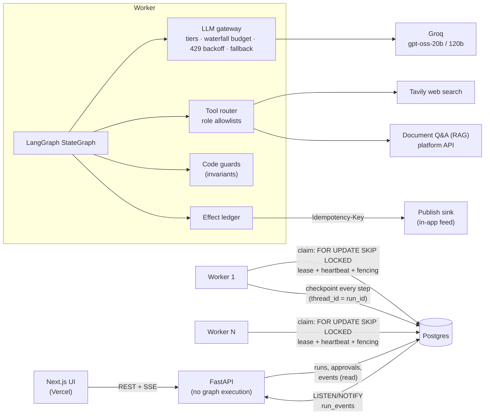
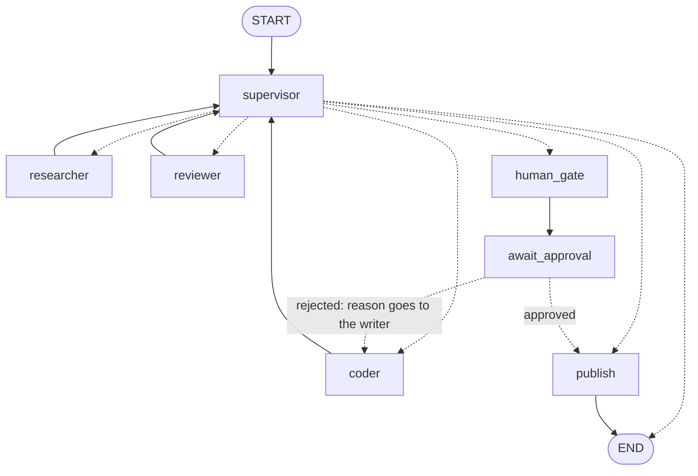

# agent-orchestrator

[](https://github.com/subidhkhanal/agent-orchestrator/actions/workflows/ci.yml)

A supervisor-worker multi-agent platform built on LangGraph and Postgres. A supervisor model
routes a research task between a **researcher**, a **writer** ("coder") and a **reviewer**
until a human approves the memo, and only then is it published. Runs survive worker crashes and
resume from the last checkpoint. Budgets are enforced before each model call, not after.
Safety rules live in code, not prompts. The one external side effect happens once, even when
the node re-executes or a human double-clicks "approve".

**Live demo:** https://agent-orchestrator-opal.vercel.app (free tiers; see [limitations](#limitations)).

Every claim below links to a test or a measured result. Where something is not measured yet,
this README says so.

## Contents
- [Architecture](#architecture) · [Graph A](#graph-a-research-memo-v1) · [Design decisions](#design-decisions)
- [Results](#results): [reliability (chaos)](#reliability-chaos-tests) · [evaluation](#evaluation-graph-a-vs-single-agent-baseline)
- [Run it locally](#run-it-locally) · [API](#api) · [Limitations](#limitations) · [Scaling to production](#scaling-to-production)

## Architecture



- **Postgres is the only backing service**: run queue (leases), LangGraph checkpoints, the
  append-only event log, approvals, the effect ledger, artifacts, and SSE fan-out via
  `LISTEN/NOTIFY`. One database means one transaction can span all of them.
- **The API never executes graphs.** It validates, writes, and streams. Workers claim runs,
  execute them, park them for approval, and resume them.
- **State** is one Pydantic model (`RunState`) changed only by validated patches. Every patch
  bumps `state_version` and is logged (ADR 0002).

## Graph A: `research-memo` v1



Dotted edges are chosen at runtime. The supervisor's choice first passes the code guards:
- `publish` needs a human approval of the *current* artifact version;
- the coder needs at least one source (except code-only tasks);
- below 10% of the budget, the run gets a final reviewer summary and ends;
- at zero budget, it ends with the partial artifact;
- a max-steps cap.

The human gate is two nodes. `human_gate` records the pending approval in state (and so in the
checkpoint), then `await_approval` calls `interrupt()`.

Also registered: **`quick-answer` v1** (researcher only, no supervisor; it proves the engine
is generic) and **`single-agent` v1** (the eval baseline). Graphs are immutable per version and
pinned by each run. Re-registering a version with a different topology hash is refused, both
in code and in the database.

## Design decisions

| Decision | Why (short) | ADR |
|---|---|---|
| LangGraph + Postgres checkpointer + a row lease, not Temporal | One datastore; lease with a fencing token; documented migration path | [0001](docs/adr/0001-langgraph-postgres-lease-vs-temporal.md) |
| Shared state + validated patches + event log, not message passing | One source of truth; per-role write permissions; full audit trail | [0002](docs/adr/0002-shared-state-and-event-log.md) |
| Checkpoint every step; marker event every N=5 | A crash costs at most one node's LLM work | [0003](docs/adr/0003-checkpoint-frequency.md) |
| Invariants enforced by code guards | Prompts are probabilistic; publishing unapproved content is not acceptable | [0004](docs/adr/0004-code-enforced-invariants.md) |
| Effect ledger + idempotency keys | "Exactly once" is only possible if the downstream dedupes; reconciliation otherwise | [0005](docs/adr/0005-effect-ledger-and-exactly-once.md) |
| SSE with Last-Event-ID replay, not WebSocket | One-directional traffic; exact resume from the log | [0006](docs/adr/0006-sse-vs-websocket.md) |
| Model tier per node + waterfall budget | Cheap routing, strong workers; no call can exceed what is left | [0007](docs/adr/0007-model-tiering-and-budget-waterfall.md) |

## Results

### Tests

145 automated tests: 121 unit tests, and 24 integration tests against real Postgres. All of
them use the deterministic fake LLM, so CI needs no API keys. Highlights:

| Property | Test |
|---|---|
| Stale patches are rejected (in memory and in Postgres) | `test_reducer.py::test_stale_patch_is_rejected`, `test_postgres_stores.py::test_state_commit_rejects_stale_versions` |
| Every invariant from the plan has its own test | `tests/unit/test_guards.py` (one group per invariant) |
| A worker cannot run a tool outside its allowlist, even if the model asks | `test_tool_router.py::test_worker_cannot_use_a_foreign_tool_even_if_the_model_emits_it` |
| Supervisor retries with the error and fails after 3 invalid outputs | `test_supervisor.py` |
| No run spends more than its budget | `test_graph_runs.py::test_tiny_budget_never_overspends` |
| Crash mid-run resumes from the checkpoint; finished nodes are not redone | `test_worker.py::test_crash_mid_run_resumes_from_the_last_checkpoint` |
| Zombie worker is fenced after its lease is taken over | `test_postgres_stores.py::test_expired_lease_is_reclaimed_with_a_new_attempt_and_old_writer_is_fenced` |
| 10 concurrent approvals give one resume and one publish | `test_worker.py::test_double_and_concurrent_approvals_resume_once_and_publish_once` |
| A crash after the downstream write does not duplicate the memo | `test_worker.py::test_crash_between_downstream_write_and_ledger_update_does_not_duplicate` |
| Tenant B gets 404 on tenant A's run, events, stream, artifact, approvals, cancel | `test_api.py::test_tenant_b_cannot_see_or_touch_tenant_a_runs` |
| SSE replays in order with no gaps, and resumes after `Last-Event-ID` | `test_api.py::test_sse_replays_and_resumes_after_last_event_id` |

### Reliability (chaos tests)

`scripts/chaos.py` starts 50 research-memo runs on 3 worker processes (fake LLM), and every
~1.5 s hard-kills (`taskkill /F /T` / `SIGKILL`) the worker process that currently holds a
run's lease, then starts a replacement. It also plays the human: it approves every gate, often
with 2-3 concurrent requests. Leases are 3 s.

| Seed | Runs | Worker kills (mid-run) | Completed | Runs resumed by another worker | Duplicate external effects | Gates resumed twice |
|---|---|---|---|---|---|---|
| 7 | 50 | 16 (14) | 100% | 11 | **0** | 0 |
| 11 | 50 | 13 (12) | 100% | 7 | **0** | 0 |
| 23 | 50 | 13 (13) | 100% | 10 | **0** | 0 |

Results are in `evals/results/chaos-seed*.json`. What these numbers do and do not show:
- They show resume-after-crash and idempotent approvals under real process kills: 70 of the
  150 approvals were sent as 2-3 concurrent requests, and each gate resumed its run once.
- No kill happened to land *inside* the publish call itself (the sink recorded no
  redeliveries). That exact window, where the downstream accepted but the ledger did not
  record it, is covered deterministically by the effect-ledger test above.
- The fake LLM is fast, so a run is under a second of work per node. Real runs spend much
  longer inside nodes, and a crash there wastes more tokens: the interrupted node re-runs
  (ADR 0001).

### Evaluation: Graph A vs single-agent baseline

**Status: full eval running (started 2026-09-29); results pending.**

`evals/run_eval.py` runs each task in `evals/tasks.jsonl` (30 tasks: 10 answerable from the
Document Q&A platform, 8 needing web search, 6 needing both, and 6 impossible or adversarial)
through Graph A and the single-agent baseline. Both get the same tools and the same budget
(60k tokens, $0.05). For each run it reports:
- task success (an LLM judge with a rubric, plus deterministic reference-fact checks);
- citation validity;
- cost, wall-clock time, and p95 latency per node;
- supervisor routing validity;
- runs over budget.

It also writes a spot-check file for manual review.

What limits the full run is API quota, not code. The free Groq tier allows about 200k tokens
per model per day, and a run uses about 50-60k tokens, mostly on `gpt-oss-120b`. The eval
therefore runs with `--resume --wait-for-quota`:
- when the daily quota runs out it pauses until the reset instead of recording a failure;
- a run cut off by the quota is discarded and redone later;
- tasks are interleaved across categories, so partial results stay balanced.

During the eval, fallback models are disabled so that every run uses the same models. The
current partial tables can be rebuilt at any time with `python evals/run_eval.py
--summarize-only`.

Smoke runs so far (n=2 tasks, **not results**, for transparency only):
- `rag-parental`: Graph A succeeded (judge 5/5, 80% citation validity, $0.016, 338 s; most
  of the time was rate-limit backoff). The baseline did not (judge 2/5, 14% citation
  validity, $0.018).
- `none-ceo` (impossible task): Graph A correctly did not invent a CEO profile, but ended
  without a memo explaining why, so it was scored as a failure. The baseline hit the daily
  token quota and failed.

Changes made because of the smoke runs, disclosed because they were informed by eval tasks:
1. **Citation syntax normalization.** `gpt-oss` cites in its native `【id】` format, so
   syntax is now normalized in code (ADR 0004 amendment).
2. **Supervisor prompt.** It now tells the supervisor to have the writer state what could not
   be found, instead of ending silently.
3. **Judge input.** The eval grades the research summary when a run produced no memo; this
   applies to both systems.

Expected trade-off (to be confirmed or refuted by the full run): Graph A costs more tokens per
task than one agent, because the supervisor re-reads state every step and the reviewer adds a
pass. It should win on citation validity, because a separate reviewer plus a code-level
citation check reject unsupported claims. On simple single-fact tasks the extra cost may
buy nothing.

## Run it locally

Requirements: Python 3.12, Postgres 16, Node 20+ for the UI.

```bash
python -m venv .venv && .venv/Scripts/activate        # source .venv/bin/activate on Linux/macOS
pip install -e ".[dev]"
```

**Postgres**, one of:
- `docker compose up -d postgres` (port 5433; then set `DATABASE_URL` and `TEST_DATABASE_URL`
  as in `.env.example`), or
- Windows without Docker: `powershell -File scripts/local_pg.ps1 init` creates a private
  cluster on port 5434 from your installed PostgreSQL binaries. It needs no superuser
  password, doesn't touch other servers, and writes `.env`.

Then:

```bash
alembic upgrade head
pytest                                         # 145 tests; Postgres tests skip without TEST_DATABASE_URL
python scripts/demo_offline.py --reject-first  # full run in-process, fake LLM, no services needed

# Full stack (fake LLM, no keys needed):
FAKE_LLM=true DEMO_MODE=true python -m orchestrator.worker &
FAKE_LLM=true DEMO_MODE=true python -m orchestrator.serve --port 8000 &
python scripts/e2e_smoke.py --api http://localhost:8000
cd frontend && npm install && npm run dev        # http://localhost:3000
```

Real models: put `GROQ_API_KEY` (and optionally `TAVILY_API_KEY`) in `.env` and drop
`FAKE_LLM`. `python -m orchestrator.worker` refuses to start if a model configured in
`config/models.toml` is not in the provider's live model list.

Useful scripts: `scripts/chaos.py` (reliability), `evals/run_eval.py` (evaluation;
`--fake` for an offline smoke test), and `python -m orchestrator.cli create-tenant/create-key`.

## API

| Method | Path | Notes |
|---|---|---|
| POST | `/api/v1/graph-runs` | `Idempotency-Key` required. Replays return the original run (200); the same key with a different body is 409. |
| GET | `/api/v1/graph-runs` | Recent runs for the caller's tenant |
| GET | `/api/v1/graph-runs/{id}` | Status, current state, cost so far, approvals |
| GET | `/api/v1/graph-runs/{id}/stream` | SSE; resumes after `Last-Event-ID` |
| GET | `/api/v1/graph-runs/{id}/events?after=&limit=` | Paginated audit log |
| GET | `/api/v1/graph-runs/{id}/artifacts/{artifact_id}` | Current memo and its sources |
| POST | `/api/v1/graph-runs/{id}/hitl/{gate}/approve` | Idempotent (`applied` / `duplicate`) |
| POST | `/api/v1/graph-runs/{id}/hitl/{gate}/reject` | Idempotent; `reason` goes to the writer |
| POST | `/api/v1/graph-runs/{id}/cancel` | Queued/paused: immediate. Running: at the next heartbeat. |
| GET | `/api/v1/graphs` | Registered graphs, versions, topology hashes, Mermaid |
| GET | `/api/v1/published` | The publish sink's feed |
| POST | `/api/v1/publish-sink` | The simulated downstream (honors `Idempotency-Key`) |
| GET | `/metrics`, `/health` | Prometheus metrics (derived from committed events); health check |

Errors are `{"error": {"code", "message"}}`:

| Code | Meaning |
|---|---|
| 400 | Missing `Idempotency-Key` |
| 401 | Bad or missing API key (outside demo mode) |
| 402 | Budget above the tenant's per-run allowance |
| 404 | Not found, including another tenant's resources (the same answer on purpose) |
| 409 | Idempotency body mismatch, a conflicting or expired decision, or cancelling a finished run |
| 412 | Approve/reject when the run is not paused at that gate (not reached yet, or cancelled) |
| 422 | Invalid body, or a demo task that is too long |
| 429 | Demo rate limit, with `Retry-After` |
| 503 | Demo daily USD/token cap reached (with `Retry-After`), or the database is unavailable |

## Limitations

- **Evaluation results are pending** (see above). No quality claim is made yet.
- **Free-tier demo.** The live demo (Vercel + Render + Neon, all free tiers; see
  [docs/deploy.md](docs/deploy.md)) shares Groq's free daily token quota. When it is used up,
  runs are rate-limited and the budget guard ends them early with a partial result.
- **Zombie checkpoint window.** Our own tables are fenced by the lease generation, but
  LangGraph's checkpoint writes are not. A paused worker that lost its lease could write one
  extra checkpoint before its next fenced write fails (ADR 0001).
- **Single provider.** The primary and fallback models are both on Groq, so a Groq outage
  stops runs. Adding a second provider is a config change.
- **In-memory rate limiter.** The demo's per-client limit lives in API process memory, so it
  is correct for one API instance only.
- **Re-executed nodes cost tokens twice.** A node interrupted by a crash re-runs its LLM
  calls, and its output can differ from the first attempt's. The audit log keeps both
  attempts.
- **Small, synthetic document corpus.** The RAG corpus is the Document Q&A platform's sample
  library (a fictional company's policies), and eval tasks were written by the author.
- **Coder sandbox is a stub.** `spawn_sandbox` returns "unavailable"; code execution is out of
  scope.
- **Demo tenant is shared.** All anonymous visitors share one tenant; run ids are
  unguessable UUIDs, but runs are not private to one visitor.

## Scaling to production

The design target in the plan is about 5,000 tenants and 10,000 concurrent runs. That scale
was not built here; this section is the math and the changes it would force.

**Assumptions** (from local measurements with the fake LLM, and from the real smoke runs):
- A run is ~12 super-steps, ~65 events, ~15 LLM calls and ~30k tokens.
- Active execution takes ~5 minutes; approval waits last minutes to hours.
- Storage per run: ~40 KB of events, ~60-200 KB of checkpoints (more with real source
  snippets in state), and ~5-10 KB of artifacts.

**10,000 concurrently executing runs** (not waiting for humans):

| Quantity | Estimate |
|---|---|
| Run throughput | 10,000 / 300 s ≈ **33 runs/s** started and finished |
| LLM tokens | 10,000 × 30k / 300 s ≈ **1M tokens/s** (≈ 10k LLM calls/s at ~100 tokens/s each, streaming) |
| Checkpoint writes | 33 runs/s × 12 steps ≈ **400 checkpoints/s** (≈ 1,500-2,000 row writes/s with blobs and pending writes) |
| Event inserts | 33 × 65 ≈ **2,200 events/s**, each with a `NOTIFY` |
| Storage/day | 33 × 86,400 ≈ 2.9M runs × ~250 KB ≈ **~700 GB/day** before pruning |

What changes, and why:
- **LLM capacity is the real bottleneck,** not our infrastructure. 1M tokens/s needs
  provider enterprise quotas across several providers. The gateway would need per-tenant
  quotas and a global token-bucket service (Redis) so that one tenant cannot starve others.
- **Checkpoints.** Use the shallow checkpointer (latest checkpoint only), prune history when
  runs finish, and keep large values out of state. This cuts storage by roughly 10x.
- **Blob storage.** Move artifacts and large tool outputs to object storage (S3/GCS), keyed by
  the same content hash; state keeps references only (it already does).
- **Message bus.** At ~2k events/s, `LISTEN/NOTIFY` on the primary becomes a problem: the
  notification queue is shared, and every API node holds a listener. Write events to Kafka or
  Redis Streams (or CDC from the events table). Stateless SSE gateways then consume per-run
  partitions. Postgres stays the system of record for audit.
- **Redis** also takes over the rate limiter, the daily spend counters, and short-lived
  caches.
- **Sharding.** Shard by `tenant_id` (every table already carries it, and every query filters
  on it). Big tenants get dedicated shards and a worker pool per shard, so noisy neighbors stay
  contained.
- **Work queue.** `SKIP LOCKED` polling is fine to a few hundred claims/s per database. Beyond
  that, per-shard queues or a real queue feeding workers, with the lease row kept for
  fencing.
- **Temporal.** It becomes worth it when runs are long and numerous enough that durable
  timers, cross-region failover and workflow versioning matter more than operating one
  more system (ADR 0001 has the migration path).
- **Long human waits.** A run waiting 24 hours holds no worker and no lease; it is one row
  plus its checkpoint. What grows is history: Temporal-style engines cap history per workflow
  (tens of thousands of events), so a workflow that loops through many review cycles needs
  "continue-as-new". The equivalent here is capping steps (`max_steps`) and pruning
  checkpoint history on completion. Expiry is a periodic sweep (`hitl_approvals.expires_at`),
  which scales with an index, not with open timers.

## Repository layout

```
src/orchestrator/
  state/      RunState, patches, reducer (version check, write ACL, validation)
  events/     event log + per-node emitter (idempotency keys, fencing)
  gateway/    LLM gateway, budget waterfall, providers (OpenAI-compatible, fake)
  tools/      tools, registry, role router, web search + RAG clients
  agents/     supervisor, workers, single-agent baseline, guards, HITL + publish, prompts
  graphs/     immutable graph specs + registry
  engine/     node runner, graph builder, local runner, durable worker
  db/         Postgres: runs/leases, events, approvals, effects ledger, artifacts, tenants
  api/        FastAPI app, SSE streaming
migrations/   Alembic (plain SQL)
config/       models.toml (real) and models.fake.toml (CI)
evals/        tasks, harness, results
scripts/      chaos test, e2e smoke test, offline demo, local Postgres
frontend/     Next.js UI
docs/adr/     architecture decision records
```
