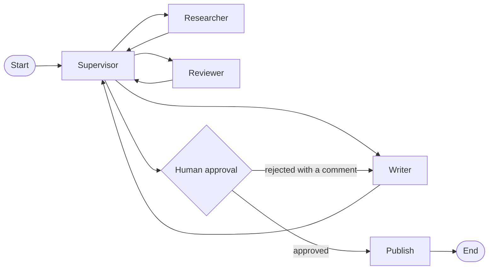

# agent-orchestrator

[](https://github.com/subidhkhanal/agent-orchestrator/actions/workflows/ci.yml)

A multi-agent system where a **supervisor** routes a research task between a **researcher**, a
**writer** and a **reviewer**, and a **human approves** the result before it is published.
Built on LangGraph, FastAPI and Postgres, running on the Claude API (Opus 5.5 agents, Haiku
5.5 routing).

**Live demo:** https://agent-orchestrator-opal.vercel.app. Pick an example task, watch the
agents work live, then approve or reject the memo.

## How it works



- The **researcher** searches the web (Tavily) and internal documents (a RAG service).
- The **writer** drafts a memo where every claim cites a source.
- The **reviewer** checks the citations. A code check backs it up, so a "pass" on an unsupported
  claim does not stand.
- The **human** approves or rejects with a comment, which goes back to the writer.

## What makes it reliable

- **Survives crashes.** Workers claim runs with a Postgres lease and save a checkpoint after
  every step. If a worker dies, another one resumes the run from the last checkpoint.
- **Publishes exactly once.** An effect ledger and idempotency keys mean a retried node or a
  double-clicked "approve" never publishes twice.
- **Safety rules live in code, not prompts.** Nothing is published without human approval of
  that exact version; the writer needs sources; every draft is reviewed once; runs stop at
  their budget and step limits.
- **Hard budgets.** Each model call is sized before it is made, so a run cannot spend more
  than its limit.
- **Full audit trail.** Every state change is a validated, versioned patch in an append-only
  log, streamed live to the UI (SSE that resumes after a reconnect).

Each decision has a short write-up in [docs/adr](docs/adr).

## Results

- **156 automated tests** (132 unit, 24 against real Postgres) run in CI with a fake model.
- **Chaos test:** 150 runs on 3 worker processes while workers were hard-killed every ~1.5 s
  (42 kills, 39 of them mid-run). Every run completed, with **0 duplicate publishes** and no
  approval applied twice ([`scripts/chaos.py`](scripts/chaos.py), results in
  `evals/results/chaos-seed*.json`).
- **Live demo run** (2026-10-09): draft, rejected with a comment, revised, approved and
  published once, in 66 s for $0.20.
- **Evaluation against a single-agent baseline:** not finished, so no quality claim is made
  ([evals/README.md](evals/README.md)).

## Run it locally

Needs Python 3.12, Postgres 16 and Node 20+.

```bash
pip install -e ".[dev]"
alembic upgrade head
pytest
python scripts/demo_offline.py --reject-first   # full run with a fake model, no keys needed
```

For real models, put `ANTHROPIC_API_KEY` (and optionally `TAVILY_API_KEY`) in `.env`, see
[.env.example](.env.example). Then run `python -m orchestrator.serve` with
`EMBEDDED_WORKER=true`, and `npm run dev` in `frontend/`.

## Limitations

- The evaluation against a single-agent baseline is not finished.
- The demo uses a small, fictional document library and shares one tenant across visitors.
- It is capped at $1.50 per run and 10 runs per hour per visitor, with no daily total.
- The rate limiter lives in memory, so it is correct for a single API instance only.
- A node interrupted by a crash re-runs its model calls, so it pays for them twice.

## More

[Deployment](docs/deploy.md) · [API reference](docs/api.md) ·
[Scaling to production](docs/scaling.md) · [Design decisions](docs/adr) ·
[Evaluation](evals/README.md)
